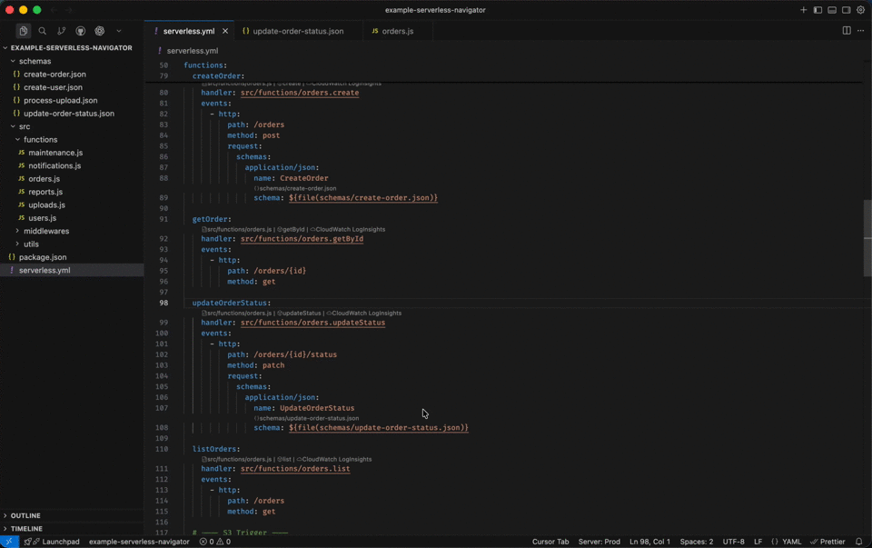
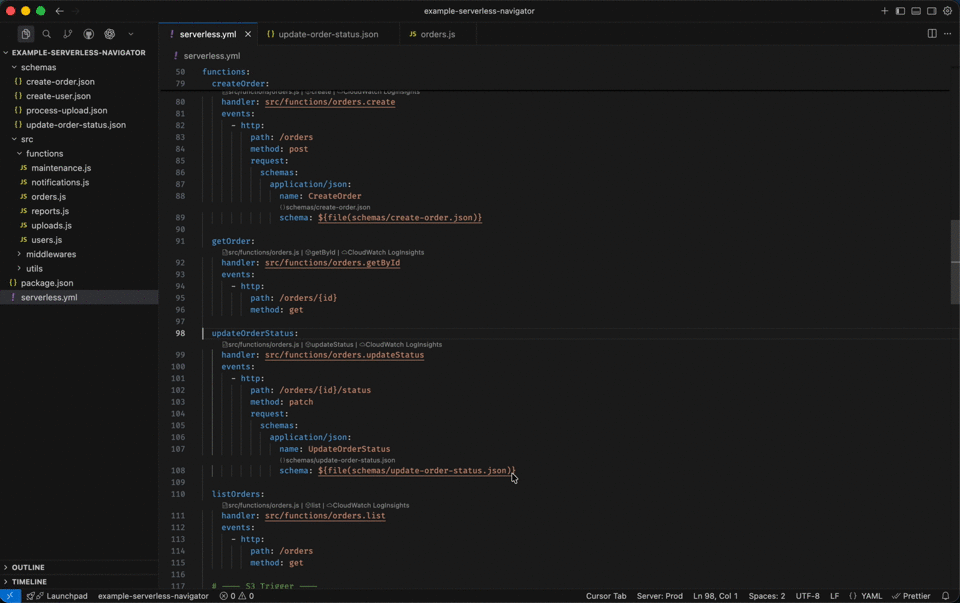

# Serverless Navigator

[](https://github.com/andreluizweb/serverless-navigator/actions/workflows/ci.yml)
[](https://marketplace.visualstudio.com/items?itemName=andreluizbatista.serverless-navigator)
[](https://marketplace.visualstudio.com/items?itemName=andreluizbatista.serverless-navigator)
[](https://open-vsx.org/extension/andreluizbatista/serverless-navigator)

VS Code extension that adds smart navigation to `serverless.yml` files. Handler values become clickable links that open the referenced source file and jump straight to the exported function. Schema references using `${file(...)}` also become navigable links to the JSON schema file.

## Features

### Handler Navigation

Bidirectional navigation between `serverless.yml` and handler functions — click a handler value to jump to the source file, or use the CodeLens above a function to navigate back to its definition in `serverless.yml`.



### Schema Navigation

Clickable links on `schema: ${file(...)}` references — open the JSON schema file directly.



### CloudWatch Log Insights

CodeLens button to open CloudWatch Log Insights filtered by the Lambda function's log group. On first use, you can pick an existing stage or enter a custom one — your selection is saved for future queries.


### More

- **Variable resolution** — supports `${self:...}`, `${opt:...}`, `${env:...}`
- **Monorepo support** — resolves paths relative to both `serverless.yml` and workspace root
- **Zero runtime dependencies** — lightweight and fast

## Supported patterns

### Handlers

```yaml
functions:
  hello:
    handler: src/functions/hello.handler
```

### Schemas

```yaml
functions:
  createUser:
    handler: src/handlers/user.create
    events:
      - http:
          method: post
          request:
            schemas:
              application/json:
                schema: ${file(schemas/create-user.json)}
```

### Variables

```yaml
custom:
  handlersPath: src/functions

functions:
  hello:
    handler: ${self:custom.handlersPath}/hello.handler
```

## Development

```bash
npm install
npm run compile
npm run test
```

Press `F5` in VS Code to launch the Extension Development Host for testing.
